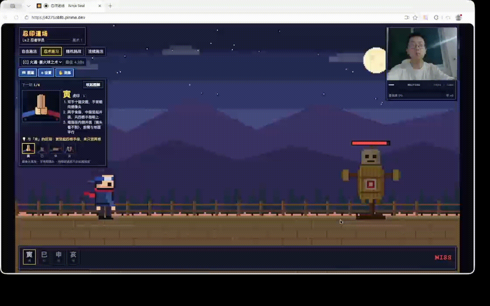

# 忍印道场 · Ninja Seal Dojo

对着摄像头结出十二手印，释放 28 种像素风忍术。全部识别在浏览器本地完成，纯静态站点即可部署。

- 手印识别：YOLOX-Nano（[NARUTO-HandSignDetection](https://github.com/Kazuhito00/NARUTO-HandSignDetection)，onnxruntime-web）+ MediaPipe Hand Landmarker 骨架 + 个人 KNN 模型
- 渲染：PixiJS v8，480×270 内部分辨率像素风
- 存储：Dexie（IndexedDB），保存个人记录、手印训练样本

## 效果演示



## 快速开始

```bash
npm install        # .npmrc 已配置 npmmirror 国内源；postinstall 会复制 wasm 到 public/wasm
npm run setup      # 下载模型到 public/models（已下载则跳过），并复制 wasm
npm run dev        # 开发服务器 http://localhost:5173
npm run build      # 类型检查 + 打包到 dist/
npm run preview    # 预览打包结果
```

模型文件已放在 `public/models/`：

| 文件 | 用途 |
| --- | --- |
| `yolox_nano.onnx` | 十二手印检测（主模型） |
| `hand_landmarker.task` | 手部 21 点骨架（显示骨架、个人模型训练 / 识别） |

`setup` 脚本会优先使用 GitHub 直连，失败时尝试国内镜像；若仍失败，可手动下载后放入 `public/models/`。

## 玩法

| 模式 | 说明 |
| --- | --- |
| 自由施法 | 任意结印，自动匹配忍术；结印中显示前缀候选 |
| 忍术练习 | 选定忍术，按提示逐个结印，记录最佳时间 |
| 随机挑战 | 倒计时后随机出题，限时完成计分 |
| 连续施法 | 状态持续更久，触发元素反应（感电、蒸汽爆发、冰封、火焰增强、碎石爆炸…） |

- 键盘备用：`1 2 3 4 5 6 7 8 9 0 Q W` 对应 子 丑 寅 卯 辰 巳 午 未 申 酉 戌 亥；`空格` 清空序列；`Enter` 开始 / 下一题；`B` 打开图鉴；`Esc` 关闭弹窗
- 图鉴中可对任意忍术「练习」或「演示」
- 「训练」面板可采集自己的手印样本（保存在本机 IndexedDB），在内置模型不稳定时提升识别率
- 「设置」可一键切换识别宽松度（宽松 / 标准 / 严格），也可单独调识别阈值、稳定窗口、保持时间、识别帧率、序列超时等
- 默认开启「宽松辅助」：练习 / 挑战的下一印、自由模式中可接续的印，手势摆得差不多即可确认

## 部署

`npm run build` 后将 `dist/` 上传到任意静态服务器（Nginx、OSS、GitHub Pages 等）即可。

- 必须通过 **HTTPS**（或 localhost）访问，浏览器才允许打开摄像头。
- 可选：配置以下响应头以启用 onnxruntime 多线程 wasm；不配置时自动回退为单线程，功能不受影响。

  ```
  Cross-Origin-Opener-Policy: same-origin
  Cross-Origin-Embedder-Policy: require-corp
  ```
- `vite.config.ts` 中 `base: './'` 使用相对路径，可直接部署在任意子路径下。

## 目录

```
src/
  gesture/   摄像头、YOLOX 分类器、MediaPipe 骨架、稳定器、结印状态机、个人模型
  jutsu/     忍术数据 (jutsu.json)、序列匹配、JutsuManager（模式 / 评分 / 记录）
  game/      Pixi 场景：Stage、Ninja、Dummy、Camera、Particles、VFXManager、Game
  effects/   五行 + 其他忍术特效
  components/ CameraView、SealBar、JutsuBook、SettingsPanel、SealGuide（手印示意图）、PracticeGuide（练习图解）
  store/     全局响应式状态、Dexie 数据库
  audio/     WebAudio 合成音效
```

## 许可

手印检测模型来自 Kazuhito00/NARUTO-HandSignDetection，许可见 `public/models/LICENSE-NARUTO-HandSignDetection.txt`。
